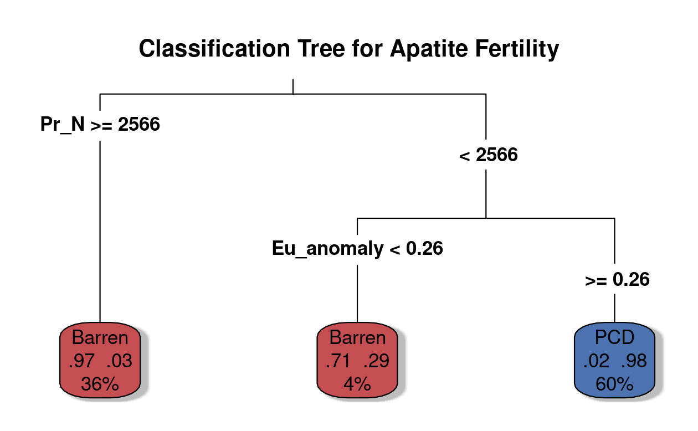

Apatite Geochemistry as a Proxy for PCD Fertility
================
by Santiago Ramos Galarza

## Summary

This repository documents the statistical evaluation of apatite trace-element chemistry to predict magmatic fertility by comparing the geochemical signatures of Porphyry Copper Deposits (PCDs) intrusions with those of barren magmatic systems. 

Apatite is an accessory mineral that incorporates trace elements, including Rare Earth Elements (REEs), during crystallization. Because trace element partitioning is highly sensitive to the oxidation state of the magma, these elements act as recorders of magmatic processes. 

A critical proxy is the Europium anomaly ($Eu/Eu^*$). Europium is a redox-sensitive element; under the oxidized conditions typical of fertile porphyry systems, it behaves differently than under reduced conditions. Apatite chemistry thus significantly impacts our ability to understand the conditions that generate economic copper deposits, helping mineral exploration by enabling early identification of fertile systems, which drive cost-effective targeting and reduce exploration risk.

## Objectives

- Determine if a statistically significant difference exists in the Europium anomaly between PCD-fertile and barren magmatic systems.
- Construct and validate a classification tree utilizing the full suite of REE concentrations.

## Dataset

The data are stored in `apatite_data.csv`. After cleaning and normalizing to C1 Chondrite values (McDonough & Sun, 1995), the dataset has:

- 177 rows, 18 columns
-  2 variables that are character/categorical (`Sample_ID`, `Type`)
-  43 variables that are numeric (14 Chondrite-normalized REEs, `Eu_anomaly`, and raw ppm and error values)
- Key variables: 

   **Sample Metadata**
   - `Sample_ID` – individual laser spot identifier
   - `Type` – categorical classification (`PCD` or `Barren`)
   

  **Calculated Proxies**
  - `Eu_anomaly` – ($Eu/Eu^*$)


  **Chondrite-Normalized REEs**
  - `La_N` through `Lu_N` – continuous numeric variables representing the normalized concentration of each Lanthanide series element.

## Methodology
First, imported the LASS-ICP-MS trace element data and set up our C1 Chondrite reference values. The `Eu_anomaly` was calculated by this formula:

$$Eu/Eu^* = \frac{Eu_N}{\sqrt{Sm_N \times Gd_N}}$$

For our statistical validation, the `infer` package was utilized. A randomization test (1000 permutations) was run to test the null hypothesis of independence, followed by generating a 95% Bootstrap Confidence Interval (1000 resamples) to quantify the exact difference in means between the two groups without relying on parametric assumptions. Then the linear model `lm(Eu_anomaly ~ Type)` was applied using `broom::augment()` to extract the $R^2$ and RMSE.

```markdown

## REE ANALYSIS

df_long <- df_clean %>%
  select(Type, Eu_anomaly, La_N:Lu_N) %>%
  pivot_longer(cols = -Type, names_to = "Element", values_to = "Value")

analyze_element <- function(sub_df) {
  set.seed(12)
  
  # Linear Model
  fit <- lm(Value ~ Type, data = sub_df)
  glance_fit <- glance(fit)
  
  # Bootstrap Confidence Interval
  boot_dist <- sub_df %>%
    specify(Value ~ Type) %>%
    generate(reps = 1000, type = "bootstrap") %>%
    calculate(stat = "diff in means", order = c("PCD", "Barren"))
  
  ci <- boot_dist %>% get_confidence_interval(level = 0.95, type = "percentile")
  
  tibble(
    R_Squared = glance_fit$r.squared,
    CI_Lower = ci$lower_ci,
    CI_Upper = ci$upper_ci
  )
}
```

| Element    | Difference_in_Means | R_Squared | Rand_P_Value | CI_Lower   | CI_Upper   |
|:-----------|--------------------:|----------:|-------------:|-----------:|-----------:|
| Pr_N       | -3541.6887          | 0.7262    | 0.000        | -3916.3028 | -3169.2894 |
| Ce_N       | -4559.7668          | 0.6995    | 0.000        | -5061.2723 | -4062.2417 |
| Nd_N       | -2215.2542          | 0.6737    | 0.000        | -2474.3732 | -1961.9822 |
| La_N       | -4329.5980          | 0.4722    | 0.000        | -4983.2641 | -3659.7099 |
| Eu_anomaly | 0.3603              | 0.3531    | 0.000        | 0.3058     | 0.4263     |
| Sm_N       | -678.2407           | 0.2645    | 0.000        | -850.4130  | -517.7063  |
| Eu_N       | 163.2830            | 0.1401    | 0.000        | 110.4300   | 212.5500   |
| Yb_N       | 81.3255             | 0.0394    | 0.008        | 30.2237    | 129.5561   |
| Tm_N       | 84.4922             | 0.0359    | 0.008        | 28.9336    | 136.9186   |
| Gd_N       | -169.3997           | 0.0346    | 0.014        | -291.2068  | -54.7879   |
| Dy_N       | 127.1274            | 0.0307    | 0.016        | 34.6093    | 211.6602   |
| Er_N       | 79.2849             | 0.0230    | 0.040        | 11.5484    | 140.5461   |
| Ho_N       | 87.8295             | 0.0223    | 0.046        | 12.4988    | 158.1271   |
| Lu_N       | 52.4331             | 0.0222    | 0.048        | 9.4891     | 94.8039    |
| Tb_N       | 81.6082             | 0.0097    | 0.212        | -24.6498   | 182.5559   |


Finally, using the `tidymodels` framework, a decision tree specification was bundled into a `workflow()`, and the model was fit to simultaneously evaluate all 14 REEs and the Eu anomaly to find the optimal classification thresholds. 

```markdown

## CLASSIFICATION TREE

tree_data <- df_clean %>%
  select(Type, Eu_anomaly, La_N:Lu_N)

tree_spec <- decision_tree() %>%
  set_mode("classification") %>%
  set_engine("rpart")

tree_recipe <- recipe(Type ~ ., data = tree_data)

tree_fit <- workflow() %>%
  add_recipe(tree_recipe) %>%
  add_model(tree_spec) %>%
  fit(data = tree_data)

```




## Findings

The observed samples exhibit distinct geochemical behavior, and trace element concentrations vary significantly with deposit type.
The `infer` test confirmed that the difference in the Eu anomaly is highly significant (p < 0.001), and the linear model confirmed that deposit type explains a substantial ~35% of the variance ($R^2$).

Data show that barren magmas skew toward highly enriched LREEs (La-Pr) relative to PCD observations.
The classification tree (Figure 1) indicates that LREE enrichment (specifically $Pr_N \ge 2566$) serves as the dominant primary filter for identifying barren rocks, while the Eu anomaly serves as the definitive secondary split.


## Conclusions and Next Steps

The trace-element chemistry of apatite successfully captures the variability in magmatic oxidation states and fractionation.

Predictive modeling based on these REE proxies is reliable enough for classifying PCDs. 
Future work should aim to validate this model against apatite from other known global PCDs systems to broaden the evaluation and to further investigate how variations in host-rock composition might shift the $Pr_N$ and $Eu$ thresholds.

## Presentation

The presentation can be found [here](presentation/presentation.html).

## References

McDonough, W. F., & Sun, S. S. (1995). The composition of the Earth. Chemical geology, 120(3-4), 223-253.
